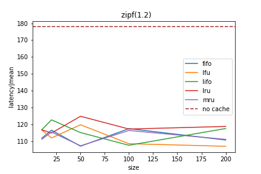
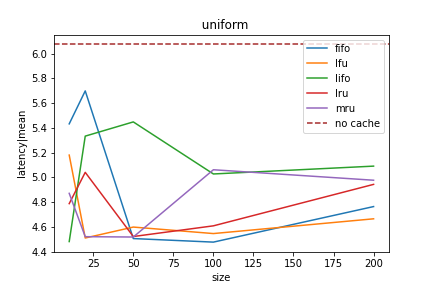
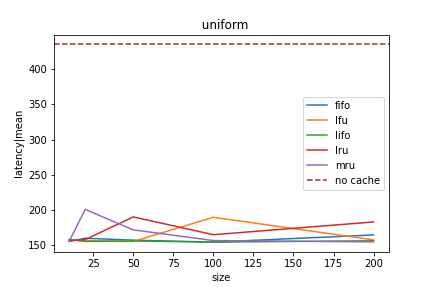
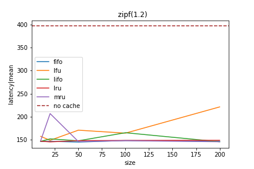

# Load-balanced Distributed Hash Tables Benefit from Caching

A *distributed hash table* (DHT) is a system that allows clients to look up entries in a large
key-value store, where the data is sharded across many different machines. A well-known example of a
DHT your computer uses every day is the [Domain Name System](https://en.wikipedia.org/wiki/Domain_Name_System) (DNS), which allows your computer to
translate from a URL to an IP address. When you told your browser to visit this article on
medium.com, the browser internally pings the DNS to know where to send its HTTP request.

The DNS is organized using a hierarchical structure. When your browser requested the IP address for
medium.com, it first pings a root DNS server to learn the address of another server responsible for
all .com websites, and that server redirects you to the medium.com server. For websites like
[princeton.edu](https://princeton.edu) that have multiple subdomains (e.g. [cs.princeton.edu](https://cs.princeton.edu]])), the DNS resolution process can
take 3-4 redirects, which is very slow. To speed up this process, the DNS aggressively caches
resolutions of common websites at local DNS servers that are physically close to the client. In
practice, this cuts the number of root DNS server accesses for a typical user down to about one per
day, rather than hundreds.

However, even with aggressive caching, the DNS still relies on the top levels of the hierarchy to be
large, beefy server clusters that can handle billions of requests per day. Meanwhile, there are
other settings that require distributed hash tables where this is just not feasible. For example,
peer-to-peer file sharing services like [BitTorrent](https://www.bittorrent.com) and
[IPFS](https://ipfs.tech) rely on DHTs to allow clients to find the location of a file stored in
their global network. However, these services are decentralized by design and cannot expect any
machine to have the compute power to act as the root of a hierarchical DHT. This issue is addressed
using load-balanced DHTs, such as Chord.

## What is Chord?

*Chord* ([Stoica et al. 2001](https:www.cs.princeton.edu/courses/archive/fall22/cos418/papers/chord.pdf)) is a distributed hash table designed to spread its request load evenly across
many nodes. Rather than having a single root node that handles the top level of every request, Chord
organizes its nodes in a ring, where each node is responsible for a subset of the key-value pairs:

In this example, we have a DHT that has nodes with IDs 0, 1, 3, 5, and 6 that can store the keys
0-7. Each key is stored at the node with the next-higher ID, modulo the number of IDs. For example,
node 3 stores keys 2 and 3, and node 0 stores keys 7 and 0. Each node also stores the identity of
its successor and predecessor, so it can redirect clients who access other keys.

To look up a key, a client can make a request to any of the nodes. If that node is responsible for
the key, it simply returns the associated value. However if a different node is responsible for that
key, the node must determine the identity of the node that is responsible.

### Finger Tables

Our node could forward the request on using its successor and predecessor pointers, but if that is
all we had, this process would be horribly slow. In the worst case, we would have to go halfway
around the ring to find the correct key, and make n / 2 network lookup requests if our ring has n
nodes.

One solution to this problem is to have every node store the identity of every other node and their
associated key range. Systems like [Dynamo](https:en.wikipedia.org/wiki/Amazon_DynamoDB) intended to run in a datacenter with relatively few nodes
actually do this. However, since Chord desires to power large peer-to-peer systems with many nodes
that can enter and leave the ring as they please, maintaining such a list at every node and keeping
them up to date is extremely tedious and error-prone. 

Instead, Chord scalably speeds up lookups using *finger tables*. In Chord, each node stores the
identities of the nodes responsible for the key 1, 2, 4, 8, 16, etc. away from its own ID. This
trick makes the entire Chord ring act similarly to a skip list rooted at every node, where our
expected number of hops is only logarithmic in the number of nodes. At the same time, it incurs only
a logarithmic storage blowup on each node that is much more practical to maintain.

Finally, Chord keeps both the successor and finger references up to date as node enter and leave the
ring by periodically sending messages internally to check the identity of the successors and finger
targets.

### Caching in Chord

Unlike hierarchical DHTs that run systems like the DNS that employ aggressive use of caching to make
them practical to deploy, the original implementation of Chord does not use caching of any kind. The
authors of the original paper did not consider it, because the structure of the finger table already
enables good scalability. The authors found experimentally that the lookup latency increases only
logarithmically with the number of nodes in the system.

But what would caching look like in Chord? If we cache the values for popular keys like in a
hierarchical DHT, we end up with a consistency problem. Suppose node A caches [k = 1] from node B,
then another node took a different path to B that does not include A, and then sets [k = 2]. A's
value becomes stale. To be precise, this violates *strong consistency*, because the cache allows a
read that is received by the system after another write operation completes to not reflect the
outcome of that write. This cannot be resolved without performing a consistency check with the
responsible node on every cache hit, defeating the purpose of the cache.

However, we can instead cache the *location* of popular keys. Then, if a node gets a cache hit, it
can skip directly to the correct node and avoid the logarithmic number of redirects to get
there. This strategy is not immune from stale entries either, if nodes join or leave the system and
change which node is reponsible for the key. However, in the uncommon event this does happen, it
only affects the performance of the lookup (extra redirects), rather than let us return a stale
value and break strong consistency.

If the original authors of the Chord paper tried this, they would have likely concluded there was a
minimal performance gain, because they assumed the distribution of lookup requests was uniform over
the key set. However, in most practical applications, the distribution of requests follows a Zipfian
distribution, where a small subset of keys are exponentially more popular than most. In this
setting, we hypothesized that caching the location of those popular keys will significantly reduce
the expected lookup time by reducing the number of hops to get to the responsible node.

## Implementation

To test this, we reproduced and reimplemented the Chord system in about 1400 lines of Rust code. Our
reimplementation allows us to validate the read latency results in the original Chord paper and
compare them directly to the latency under a breadth of scenarios, several of which were not
addressed in the original paper:

- Various cache replacement policies:
  - Least recently used (LRU)
  - Most recently used (MRU)
  - Least frequently used (LFU)
  - First-in, first-out (FIFO)
  - Last-in, first-out (LIFO)
- Various Cache Sizes (10, 20, 50, 100, 200 entries)
- Uniform or Zipfian distribution, varying the skew for the latter.
- Number of nodes, from 3 up to 500.

Our implementation closely models the behavior of the original Chord implementation. Here is a
detailed description of what is similar, and what differs between the two:

Similarities:

- One node is designated as the *master*, which is responsible for tracking the successor of every
  node. When a new node joins, it makes a special request to the master, who replies with the new
  node's successor.
- Nodes may join the system in any order, but new non-master nodes cannot make progress without a
  master present.
- When a new node joins, its successor will *offload* keys that move to the new node's key space.
- Nodes will periodically send messages to their successors to check if any new nodes have joined in between.
- Nodes periodically send internal lookup operations to receive the most up-to-date entries for their finger table.
- Client-generated read and write operations can be received by any node, for any key in the system, and work properly.

Differences:

- We do not implement fault-tolerance via data replication across several consecutive nodes, which
  is a feature of the original Chord, and only consider failure-free performance in our
  evaluation. Accordingly, our nodes do not implement failure tolerance by storing multiple
  successors. If nodes fail, the finger table entries will eventually converge to reflect the new
  state, but the successors do not. For a small number of nodes, the lack of replication in our
  implementation could cause a slight overestimate in the latency reduction from caching, because a
  request to one of the successors of the node responsible for the desired key could return
  immediately in the original Chord. Since Chord specifies to perform only a constant number of
  replications, we expect this effect to decrease as the number of nodes increases.
- The *fix finger* requests are spread out over time in our implementation. In the original, the
  requests for all fingers were issued all at once. We found that spreading them out reduced load on
  the system, especially during startup.
- The master is hard-coded to have an ID of 0 in our implementation, rather than a fixed IP
  address. This was done to accomodate the dynamic assignment of IP addresses by our simulation (see
  below).
- Each node in our implementation has a built-in client that generates writes, followed by reads,
  that we use for evaluation. The latency measurement is determined by the client. Although the
  original Chord paper's latency measurements do not consider client latency because it is out of
  the system's control, we specifically program client to incur no network latency to its associated
  Chord node. As a result, our latency results should be comparable to the original paper.
- Our implementation supports keys in the range [0, 2^64], and up to 2^32 nodes. 

### Simulation

In order to properly evaluate the benefit of caching in Chord, we desired to evaluate on a system
several hundred nodes. However, the testbed platforms we had access to like Emulab and CloudLab
tend to frown upon reserving that much hardware at once. 

Intead, we implement a simulator in about 150 lines of Rust, using the
[Mahimahi](http://mahimahi.mit.edu) network emulator. The simulator spawns any number of Chord
nodes, each inside its own network namespace, giving each its own IP address, just as if all the
nodes were on different physical machines. Mahimahi also allows tuning the round-trip latency
between each pair of nodes, which we use in our evaluations to obtain a fair comparison with the
results in the original Chord and compare the latency behavior of the simulator with a small number
of nodes to a real distributed cluster in Emulab. 

## Evaluation

Now, we show our experimental results. Our results using the simulator
were collected on a laptop with 8 cores. On the Eumlab cluster, we
used a LAN consisting of 5 pc nodes, with 2 cores each.

### Replicating Chord's Latency Results

To get our feet wet, let's run our simulation with 5 nodes, and a 60 millisecond round-trip time,
matching the experiment in the Chord paper. Here's what we get:

On the left, we have the results for a uniform distribution, and on the right, a Zipfian
distribution with a skew of 1.2, which is considered a moderate skew in the existing statistical
literature. For the uniform distribution with no cache, we get an average lookup latency of 154
milliseconds. The original paper cited a mean of just under 200 ms for a ring of this size, but with
a large variance, so our result is in line with what the original paper got! This is great, because
it validates our implementation is behaving as expected with respect to read latency and provides us
additional confidence in the result from the original paper.

What about with the caches? We can see that for the uniform distribution, the caches save us about
30-40 ms per read, and about 60 ms for the Zipfian distribution. In both cases, the results were
roughly the same regardless of the cache size and replacement policy we used. The fluctuations at
the bottom of each graph appear to have minimal pattern and are likely just experimental
noise. While a 20-30% speedup is nothing to sneeze at, we can definitely do better. This isn't all
that surprising, because with only 5 nodes, the structure of the finger table means that 3 of the 5
nodes are one hop or fewer away from any starting node, which is already the best the cache can
do. Thus, we shouldn't expect to see much benefit with 5 nodes. If we want a real speedup, we'll
need to go larger!

### Comparing the Simulator with a Real Cluster

Meanwhile, before we get there, one of the reasons we wanted to start with a 5-node test was that it
is a reasonable size to run on real distributed hardware to validate that our simulator accurately
reflects the latency behavior of a real distributed Chord deployment. So, we repeated the 5-node
experiment on the Emulab cluster using five pc nodes.

However, comparing the cluster results with our previous graph would be unfair, because the median
latency between any pair of nodes in the Emulab LAN is about 0.23 ms (measured using *ping*). For a
proper comparison, we also need to repeat the simulation with latency matching the cluster. Mahimahi
does not allow us to choose a 1-way latency less than 1 ms if we want any delay at all, so we re-ran
the simulator using the smallest possible RTT of 2 ms, which should be close enough, given the
variablility in reponse times we saw in the previous experiment. Here's what we find:

Simulation:

Cluster:

What we see is that for both the uniform and zipfian distributions, the cached results return in
between 3 and 6 ms in the simulation and around 2 ms in the cluster. The uncached results also see a
similar reduction between the two settings. This difference is expected due to our additional
introduced latency in the sim. Overall, these results match up with our expectations with regards to
the accuracy of our simulation.

### Going Big

Now that we trust our simulation to model a real-world distributed setting, what happens to our
latency if we repeat our first experiment with 100 nodes? Here's what we get:

Now we're talking! The uncached tests clocked in at 434 and 397 ms per read for the uniform and
zipfian distributions, respectively. With the cache, our latency typically ranges from 150-200 ms,
indicating the cache gets us a 2-3X speedup! Even better, it doesn't seem like increasing the cache
size gets us much in terms of latency reduction, so even a small cache gets much better performance
than none at all! As we expect, the difference is more pronounced for the zipfian distribution,
which makes sense, because the cache is able to leverage the popularity of a small subset of the
keys to get more cache hits and reduce the expected latency. Looking at the raw output from one of
our experiments with the LRU cache, we see that the cache hit rate for the zipfian distribution is
about 12% higher than for the uniform distribution on the same cache. This shows that the
distribution of requested keys does have an effect on the cache's ability to improve Chord's
performance.

** Increasing the skew **

In our previous experiments, we chose a zipf skew of 1.2, which is considered moderate, but what if
we make the distribution even more skewed? Does that make the cache do even better? We hypothesized
the answer is yes, because a higher fraction of requests for popular keys should improve our cache
hit rate, reducing the number of Chord hops and lowering latency. Taking our two best-performing
caches from our earlier testing, FIFO and LRU and using a cache size of 50, here's what the data
says:

We find that, in fact, larger skews get lower latency. However, the data indicates that for both
caches there is an obvious diminishing returns that comes with increasing the zipf skew, especially
considering that increasing the parameter exponentially increases the popularity of the most popular
keys. Observing that both plots bottom out just above 120 ms, and that our test used a simulated RTT
of 60 ms, this result indicates that even with caching, it is difficult to do better than 2 RTTs (2
redirects) on average, even with very skewed key popularity.

### What If We Go Bigger?

Alright, if you insist. We found out during testing that, on the laptop we were using for our
evaluation, the simulator can handle up to about 500 nodes before the computation overhead of
running all of the nodes on a single physical machine begins to have an adverse effect on the
experiment. One more result from the Chord paper we can replicate is to show that the increasing the
node count should only logarithmically increase the read latency. Here's what the data says:

These are the plots that differed the most from our expectactions. For
the uniform distribution, the result for the caches follows the
logarithmic pattern we expect, but the non-cached plot spikes at 100
nodes then actually decreases going to 500 nodes. Looking more closely
at our data, we found that the 100 node test had some high outliers
that inflated the average. This does not explain the decrease in
latency from the 200 to the 500 node test. This could be caused by
variations in the simulation behavior, but overall, we find the data
from the non-cached experiment to be too noisy to draw an appropriate
conclusion about the accuracy of the analagous experiment in the Chord
paper. The same goes for the FIFO test at 500 nodes, which randomly spikes at 500 nodes. While we expected LRU to be the more successful of the two at the outset, we did not expect such a spike to happen. We also attribute this spike to experimental noise and a few high outliers.

These plots show that the data from these experiments is too noisy to
draw an appropriate conclusion about the accuracy of the logarithmic
latency growth experiment in the paper. However, our confidence is
high this principle does hold in practice due to the structure of the
finger tables, particularly how they reduce the number of hops to
logarithmic in the ring size and spread out the redirects across the
system.

## Conclusion

By reimplementing and evaluating the Chord system using caches, we
find that peer-to-peer distributed hash tables can achieve significant
latency reduction using caches, especially when a small number of keys
are much more popular than others, as is true in most practical
applications. Our Zipf parameter ablation study shows that the benefit
seems to cap around 2 RTTs when running with 100 nodes, even for
wildly skewed popularity distributions. Our results also validate the
latency results from the original Chord paper, particularly that the
standard uncached Chord achieves a latency on the order of a few
hundred milliseconds when run with a 60 ms RTT between nodes.

There are a few interesting directions we did not explore in this
project. First, does the benefit from caching hold in Chord if we
allow arbitrary node failures, and does it make failure recovery
harder or easier? Second, is it also possible to improve latency by
being clever about how nodes in different physical locations are
assigned IDs? For example, are nodes that are physically close
together better off having IDs close to one another or further apart?
Is it better to assign a range with a very popular key to a centrally
located node?

Our main takeaway from this project is that distributed hash tables do
not need to sacrifice load balancing in order to achieve performance
gains through caching. As existing peer-to-peer systems like IPFS
continue to struggle with performace, we would like to see others
examine how to make DHTs more performant in order to allow more
practical decentralized applications in the future.
